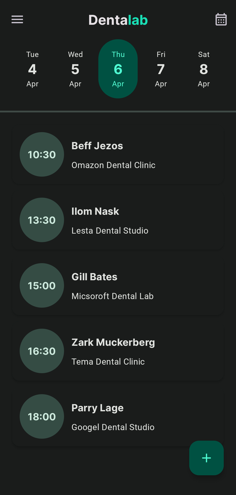
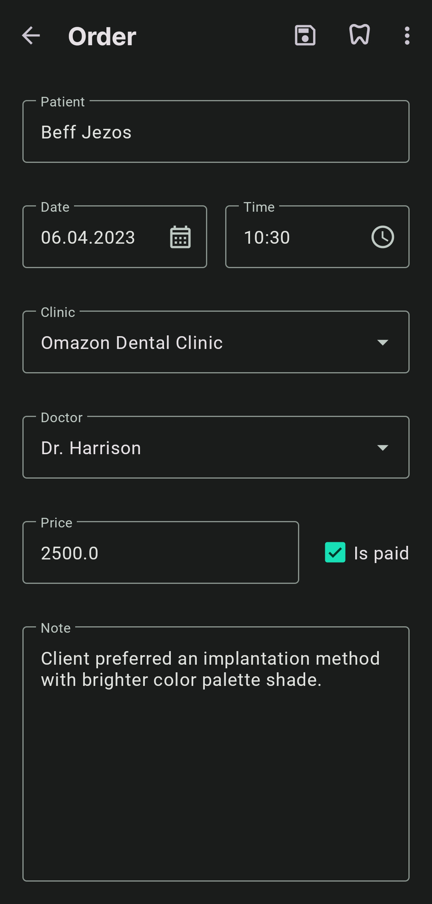
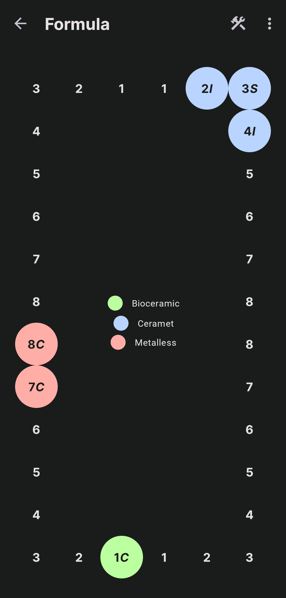
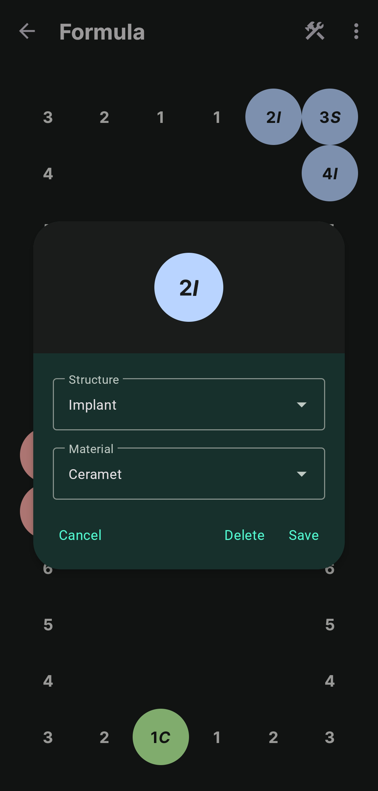
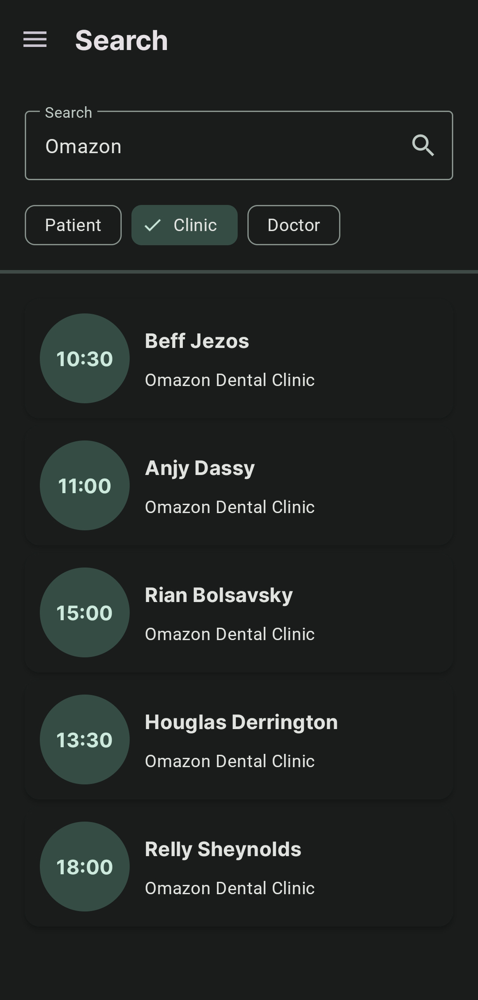
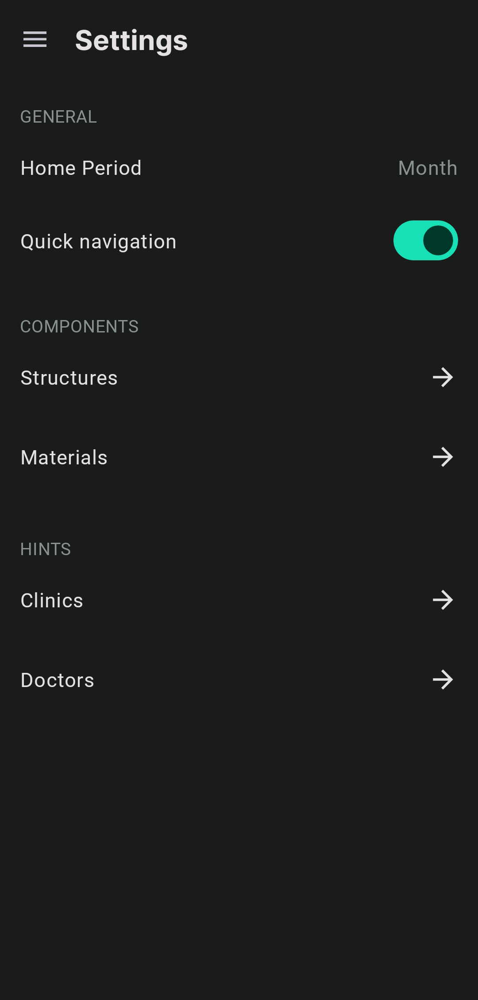
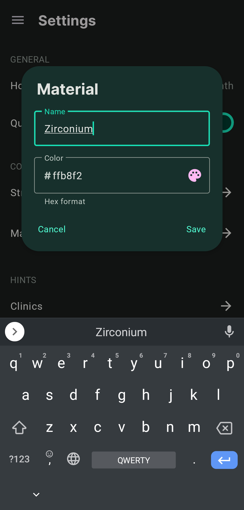

<div>
  
  <h1 style="margin-top: 0">Dentalab</h1>
</div>

Dentalab is sample Android application for managing dental clinic's client journal.
Being an independent solution, Dentalab allows to work with multiple records of orders, 
perform filtered searching, and modify teeth formula via a simple built-in editor.


## Screenshots

<div style="width: 800px">
  <div align="center">
    
    
    
  </div>
  <div>
    
    
    
    
  </div>
</div>


## Technologies & Approaches

- [**Kotlin**](https://developer.android.com/kotlin)
  as programming language
    - [**kotlinx.DateTime**](https://github.com/Kotlin/kotlinx-datetime)
      for date & time manipulations
- [**Coroutines**](https://kotlinlang.org/docs/coroutines-overview.html)
  as asynchronous and multithreading operations framework
- [**Dagger Hilt**](https://developer.android.com/training/dependency-injection/hilt-android)
  for dependency injection
- [**XML**](https://developer.android.com/develop/ui/views/layout/declaring-layout)
  for building user interface layouts
    - [**Material Design 3**](https://m3.material.io)
      as user interface design toolkit
    - [**ViewBinding**](https://developer.android.com/topic/libraries/view-binding)
      for accessing .xml view hierarchy
    - [**Skydoves ColorPicker**](https://github.com/skydoves/ColorPickerView)
      for implementing color picker
- **Single Activity Architecture**
  for user interface structuring
    - [**Fragments**](https://developer.android.com/guide/fragments)
      for managing user interface destinations
- [**androidx.Lifecycle**](https://developer.android.com/topic/libraries/architecture/lifecycle)
  for implementing **Model-View-Intent** pattern
- [**Navigation Component**](https://developer.android.com/guide/navigation)
  for navigation
    - [**Safe Args**](https://developer.android.com/guide/navigation/navigation-pass-data#Safe-args)
      for transferring type-safe data between destinations
- [**Room**](https://developer.android.com/training/data-storage/room)
  for deploying & managing local database
- [**Preferences DataStore**](https://developer.android.com/topic/libraries/architecture/datastore#preferences-datastore)
  as key-value pairs storage
- [**Gradle Kotlin DSL**](https://developer.android.com/studio/build/migrate-to-kts)
  for managing build configurations


## Unique Features

**i.e. what is unique among other samples?**

- **Model-View-Intent** pattern for implementing unidirectional UI layer data flow via
  [**state, events & intents**](https://github.com/rskopyl/Dentalab/blob/main/app/src/main/java/com/rskopyl/dentalab/util/IntentViewModel.kt)
- Custom **LayoutManager** for displaying
  [**formula modifications**](https://github.com/rskopyl/Dentalab/blob/main/app/src/main/java/com/rskopyl/dentalab/ui/formula/FormulaLayoutManager.kt)
  list in circular shape
- Custom **SmoothScroller** for centering
  [**home screen dates**](https://github.com/rskopyl/Dentalab/blob/main/app/src/main/java/com/rskopyl/dentalab/ui/home/CenterSmoothScroller.kt)
- Usage of Material 3 date and time pickers for 
  [**order form**](https://github.com/rskopyl/Dentalab/blob/main/app/src/main/java/com/rskopyl/dentalab/ui/order/OrderFragment.kt)
  simplification
- Replacing **toolbar action mode** for
  [**copying and erasing**](https://github.com/rskopyl/Dentalab/blob/main/app/src/main/java/com/rskopyl/dentalab/ui/formula/FormulaFragment.kt)
  formula tools


##  License

```
MIT License

Copyright (c) 2023 Rostyslav Kopyl

Permission is hereby granted, free of charge, to any person obtaining a copy
of this software and associated documentation files (the "Software"), to deal
in the Software without restriction, including without limitation the rights
to use, copy, modify, merge, publish, distribute, sublicense, and/or sell
copies of the Software, and to permit persons to whom the Software is
furnished to do so, subject to the following conditions:

The above copyright notice and this permission notice shall be included in all
copies or substantial portions of the Software.

THE SOFTWARE IS PROVIDED "AS IS", WITHOUT WARRANTY OF ANY KIND, EXPRESS OR
IMPLIED, INCLUDING BUT NOT LIMITED TO THE WARRANTIES OF MERCHANTABILITY,
FITNESS FOR A PARTICULAR PURPOSE AND NONINFRINGEMENT. IN NO EVENT SHALL THE
AUTHORS OR COPYRIGHT HOLDERS BE LIABLE FOR ANY CLAIM, DAMAGES OR OTHER
LIABILITY, WHETHER IN AN ACTION OF CONTRACT, TORT OR OTHERWISE, ARISING FROM,
OUT OF OR IN CONNECTION WITH THE SOFTWARE OR THE USE OR OTHER DEALINGS IN THE
SOFTWARE.
```